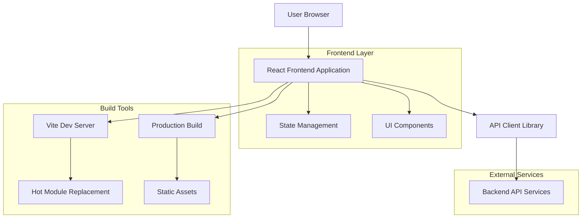
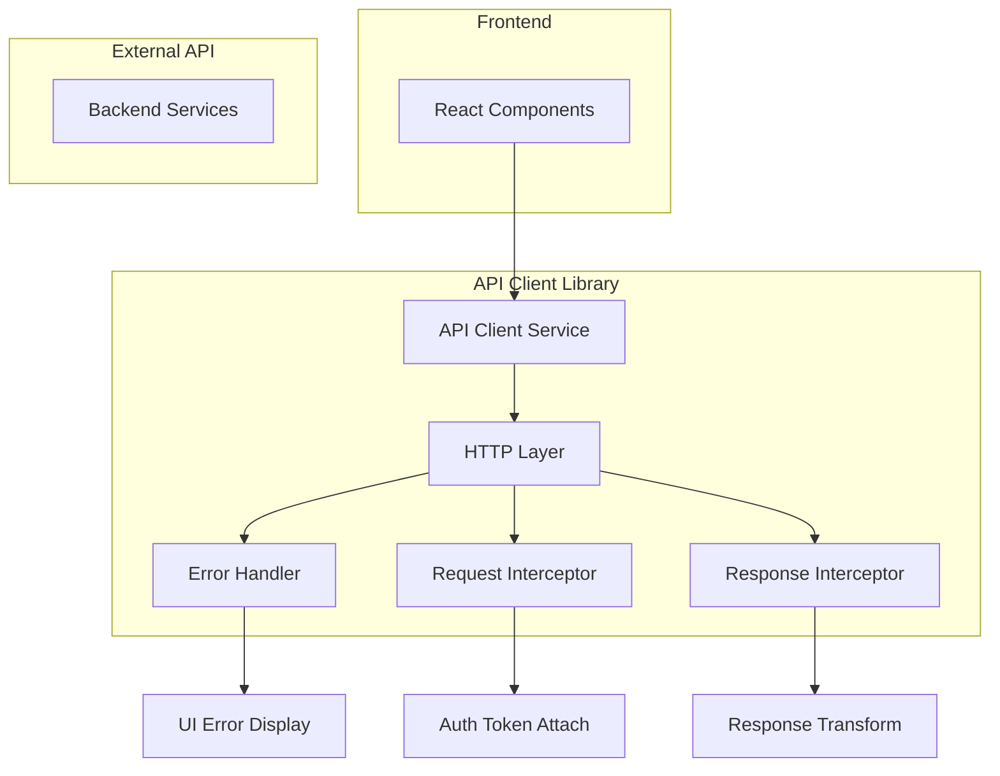
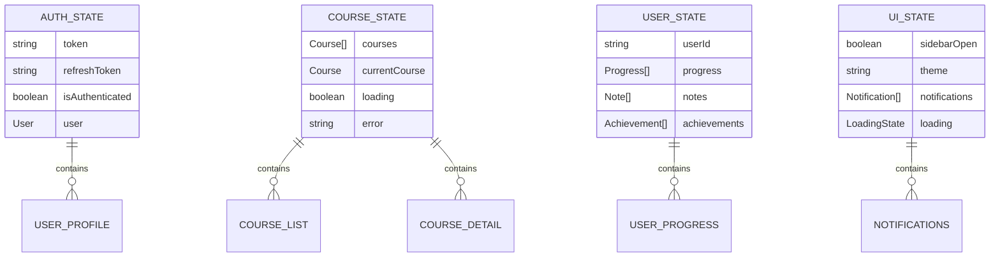

## 1. Thiết kế kiến trúc



## 2. Mô tả công nghệ

- **Frontend**: React@18 + TypeScript@5 + Vite@6
- **Styling**: TailwindCSS@4 + PostCSS
- **State Management**: Redux Toolkit@2 + React Redux@9
- **Routing**: React Router@7 (SPA mode)
- **Build Tool**: Vite@6 with SWC for fast compilation
- **Linting**: ESLint@9 + TypeScript ESLint@8
- **Testing**: Jest@30 + React Testing Library@16
- **Initialization Tool**: vite-init (create-vite)
- **Backend**: Giữ nguyên API services hiện tại
- **Package Manager**: npm (giữ nguyên từ project hiện tại)

## 3. Định nghĩa routes

| Route | Mục đích |
|-------|----------|
| `/` | Trang chủ, hiển thị thông tin chào mừng và navigation |
| `/dashboard` | Dashboard chính với course list và statistics |
| `/courses` | Danh sách tất cả khóa học với filtering options |
| `/courses/:id` | Chi tiết khóa học cụ thể |
| `/learn/:courseId` | Trang học tập với video player và notes |
| `/profile` | User profile và settings |
| `/auth/login` | Login page |
| `/auth/register` | Registration page |
| `/auth/forgot-password` | Password reset page |
| `/admin` | Admin dashboard (protected route) |
| `/admin/users` | User management (admin only) |
| `/admin/courses` | Course management (admin only) |

## 4. Định nghĩa API (giữ nguyên từ backend hiện tại)

### 4.1 Core API Endpoints

**Authentication APIs:**
```
POST /api/auth/login
POST /api/auth/register  
POST /api/auth/logout
POST /api/auth/refresh
POST /api/auth/forgot-password
```

**Course APIs:**
```
GET /api/courses - Get all courses
GET /api/courses/:id - Get course details
POST /api/courses - Create course (admin)
PUT /api/courses/:id - Update course (admin)
DELETE /api/courses/:id - Delete course (admin)
```

**User APIs:**
```
GET /api/users/profile - Get user profile
PUT /api/users/profile - Update profile
GET /api/users/progress - Get learning progress
POST /api/users/enroll - Enroll in course
```

**Learning APIs:**
```
GET /api/lessons/:id - Get lesson content
POST /api/progress - Update progress
GET /api/notes - Get user notes
POST /api/notes - Create note
PUT /api/notes/:id - Update note
```

### 4.2 API Client Types (TypeScript)

```typescript
// Base types
interface ApiResponse<T> {
  data: T;
  message?: string;
  status: number;
}

interface ApiError {
  message: string;
  status: number;
  errors?: Record<string, string>;
}

// User types
interface User {
  id: string;
  email: string;
  name: string;
  avatar?: string;
  role: 'user' | 'admin';
  createdAt: string;
}

interface LoginRequest {
  email: string;
  password: string;
}

interface LoginResponse {
  user: User;
  token: string;
  refreshToken: string;
}

// Course types
interface Course {
  id: string;
  title: string;
  description: string;
  thumbnail: string;
  instructor: string;
  duration: number;
  lessons: Lesson[];
  enrolled: boolean;
  progress: number;
  createdAt: string;
}

interface Lesson {
  id: string;
  title: string;
  description: string;
  videoUrl: string;
  duration: number;
  order: number;
  completed: boolean;
}

// Progress types
interface Progress {
  courseId: string;
  userId: string;
  completedLessons: string[];
  totalLessons: number;
  lastAccessedAt: string;
}
```

## 5. Kiến trúc server (API Client Layer)



## 6. Mô hình dữ liệu

### 6.1 State Management Structure



### 6.2 Redux Store Structure

```typescript
interface RootState {
  auth: {
    user: User | null;
    token: string | null;
    isLoading: boolean;
    error: string | null;
  };
  courses: {
    items: Course[];
    currentCourse: Course | null;
    isLoading: boolean;
    error: string | null;
  };
  ui: {
    sidebarOpen: boolean;
    theme: 'light' | 'dark';
    notifications: Notification[];
  };
  learning: {
    currentLesson: Lesson | null;
    notes: Note[];
    progress: Progress;
    isLoading: boolean;
  };
}
```

## 7. Migration Strategy

### 7.1 Phase 1: Setup & Configuration
- Khởi tạo Vite project mới
- Cấu hình TypeScript, ESLint, Prettier
- Setup TailwindCSS v4
- Cấu hình path aliases giống Next.js

### 7.2 Phase 2: Component Migration
- Chuyển đổi page components sang React Router
- Migrate layout và shared components
- Update import paths và aliases
- Test từng component một

### 7.3 Phase 3: State & API Integration
- Migrate Redux setup
- Update API client cho SPA environment
- Implement authentication flow mới
- Test API integration

### 7.4 Phase 4: Build & Deploy
- Cấu hình production build
- Setup CI/CD pipeline mới
- Deploy testing environment
- Performance testing và optimization

## 8. Configuration Files

### 8.1 Vite Configuration (vite.config.ts)
```typescript
import { defineConfig } from 'vite'
import react from '@vitejs/plugin-react-swc'
import path from 'path'

export default defineConfig({
  plugins: [react()],
  resolve: {
    alias: {
      '@': path.resolve(__dirname, './src'),
      '@components': path.resolve(__dirname, './src/components'),
      '@utils': path.resolve(__dirname, './src/utils'),
      '@store': path.resolve(__dirname, './src/store'),
    },
  },
  server: {
    port: 3000,
    proxy: {
      '/api': {
        target: 'http://localhost:8080',
        changeOrigin: true,
      },
    },
  },
  build: {
    outDir: 'dist',
    sourcemap: true,
    rollupOptions: {
      output: {
        manualChunks: {
          vendor: ['react', 'react-dom', 'react-router-dom'],
          ui: ['@headlessui/react', '@heroicons/react'],
        },
      },
    },
  },
})
```

### 8.2 TypeScript Configuration (tsconfig.json)
```json
{
  "compilerOptions": {
    "target": "ES2020",
    "useDefineForClassFields": true,
    "lib": ["ES2020", "DOM", "DOM.Iterable"],
    "module": "ESNext",
    "skipLibCheck": true,
    "moduleResolution": "bundler",
    "allowImportingTsExtensions": true,
    "resolveJsonModule": true,
    "isolatedModules": true,
    "noEmit": true,
    "jsx": "react-jsx",
    "strict": true,
    "noUnusedLocals": true,
    "noUnusedParameters": true,
    "noFallthroughCasesInSwitch": true,
    "baseUrl": ".",
    "paths": {
      "@/*": ["src/*"],
      "@components/*": ["src/components/*"],
      "@utils/*": ["src/utils/*"],
      "@store/*": ["src/store/*"]
    }
  },
  "include": ["src"],
  "references": [{ "path": "./tsconfig.node.json" }]
}
```

## 9. Performance Considerations

- **Code Splitting**: Automatic với Vite, manual chunks cho vendor libraries
- **Lazy Loading**: React.lazy() cho route-based code splitting
- **Image Optimization**: Sử dụng modern formats (WebP, AVIF)
- **Bundle Analysis**: Source-map explorer cho bundle size analysis
- **Caching Strategy**: Service worker cho offline capability
- **Tree Shaking**: Dead code elimination với Rollup

## 10. Testing Strategy

- **Unit Tests**: Jest + React Testing Library cho components
- **Integration Tests**: Testing Library cho user flows
- **E2E Tests**: Playwright cho critical user journeys
- **Performance Tests**: Lighthouse CI cho performance monitoring
- **Bundle Tests**: Size limits và performance budgets