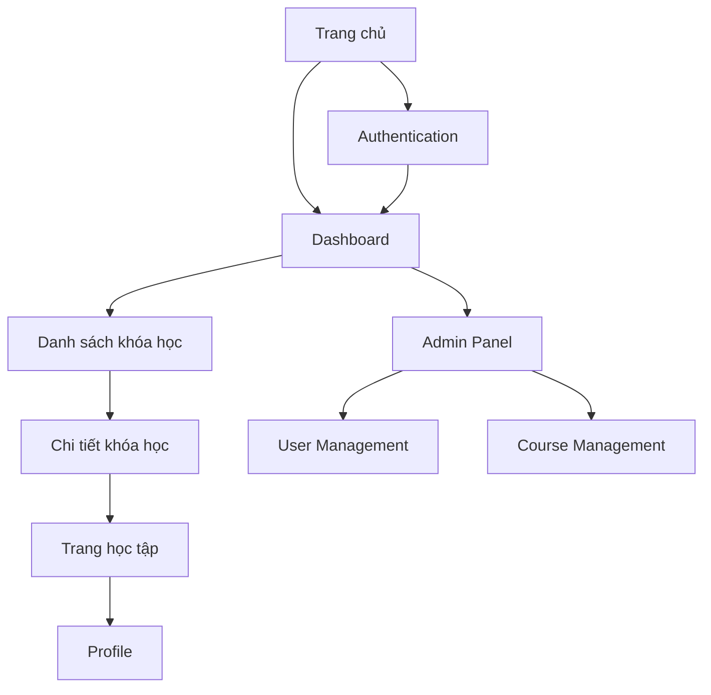

## 1. Tổng quan sản phẩm

Dự án chuyển đổi big-problem-client từ Next.js sang Vite nhằm cải thiện hiệu suất phát triển, giảm thời gian build và đơn giản hóa kiến trúc. Sản phẩm này sẽ giúp đội phát triển có trải nghiệm development nhanh hơn, build time nhanh hơn và kiến trúc đơn giản hơn so với Next.js hiện tại.

* Mục tiêu: Giảm thời gian build 50%, cải thiện HMR speed, đơn giản hóa configuration

* Người dùng: Development team, DevOps team

* Giá trị: Tăng năng suất phát triển, giảm complexity, dễ maintain hơn

## 2. Tính năng cốt lõi

### 2.1 Vai trò người dùng

| Vai trò         | Phương thức đăng ký | Quyền hạn cốt lõi                          |
| --------------- | ------------------- | ------------------------------------------ |
| Developer       | Tài khoản công ty   | Truy cập codebase, chạy development server |
| DevOps Engineer | Tài khoản công ty   | Deploy application, quản lý CI/CD          |
| QA Engineer     | Tài khoản công ty   | Test application, báo cáo bugs             |

### 2.2 Mô-đun tính năng

Ứng dụng sau chuyển đổi sẽ bao gồm các trang chính sau:

1. **Trang chủ**: Hiển thị thông tin chào mừng, dữ liệu từ API, navigation chính
2. **Trang dashboard**: Quản lý nội dung học tập, thống kê, user management
3. **Trang chi tiết khóa học**: Hiển thị chi tiết khóa học, content, materials
4. **Trang học tập**: Interface học tập trực tuyến, video player, notes
5. **Trang profile**: Thông tin người dùng, settings, learning progress

### 2.3 Chi tiết trang

| Tên trang         | Mô-đun            | Mô tả tính năng                                                  |
| ----------------- | ----------------- | ---------------------------------------------------------------- |
| Trang chủ         | Hero section      | Hiển thị banner chính, call-to-action buttons, responsive design |
| Trang chủ         | Navigation bar    | Menu chính với user authentication, responsive mobile menu       |
| Trang chủ         | API Data Display  | Fetch và hiển thị dữ liệu từ backend API, error handling         |
| Dashboard         | Course List       | Hiển thị danh sách khóa học với filtering và sorting             |
| Dashboard         | Statistics Cards  | Cards hiển thị thống kê học tập, progress indicators             |
| Dashboard         | User Management   | Quản lý người dùng, roles, permissions (admin only)              |
| Chi tiết khóa học | Course Header     | Thông tin khóa học: title, description, instructor               |
| Chi tiết khóa học | Content Tree      | Tree view của course content với chapters và lessons             |
| Chi tiết khóa học | Enrollment Button | Button để enroll/unenroll khóa học                               |
| Trang học tập     | Video Player      | Video player với controls, quality settings, subtitles           |
| Trang học tập     | Notes Panel       | Panel để ghi chú trong khi học, save/load notes                  |
| Trang học tập     | Progress Tracker  | Theo dõi tiến độ học tập, completion status                      |
| Profile           | User Info         | Hiển thị và edit thông tin người dùng                            |
| Profile           | Learning Progress | Progress chart, completed courses, achievements                  |
| Profile           | Settings          | User preferences, notification settings, theme selection         |
| Authentication    | Login Page        | Form đăng nhập với validation, error messages                    |
| Authentication    | Register Page     | Form đăng ký với email verification                              |
| Authentication    | Password Reset    | Flow reset password với email confirmation                       |

## 3. Luồng hoạt động cốt lõi

### Luồng người dùng thông thường

1. User truy cập trang chủ → Xem thông tin tổng quan → Navigate đến dashboard
2. Trên dashboard → Browse danh sách khóa học → Chọn khóa học quan tâm
3. Xem chi tiết khóa học → Click enroll → Bắt đầu học tập
4. Trong quá trình học → Xem video → Ghi chú → Theo dõi progress
5. Hoàn thành khóa học → Cập nhật profile → Xem achievements

### Luồng quản trị viên

1. Admin login → Access admin dashboard → Quản lý users và courses
2. Tạo/Cập nhật khóa học → Upload content → Set permissions
3. Monitor user progress → Generate reports → Export analytics

## 4. Thiết kế giao diện người dùng

### 4.1 Phong cách thiết kế

* **Màu sắc chính**: Blue gradient (#3B82F6 → #1E40AF), white background

* **Màu sắc phụ**: Gray scale (slate-50, slate-200, slate-600, slate-800)

* **Button style**: Rounded corners (rounded-lg), shadow effects, hover animations

* **Typography**: System fonts, font-size 16px base, line-height 1.5

* **Layout style**: Card-based layout, responsive grid system

* **Icons**: SVG icons, consistent stroke width (2px), currentColor fill

* **Animations**: Smooth transitions, fade-in effects, loading skeletons

### 4.2 Tổng quan thiết kế trang

| Tên trang         | Mô-đun         | Thành phần UI                                                         |
| ----------------- | -------------- | --------------------------------------------------------------------- |
| Trang chủ         | Hero section   | Full-width banner với gradient background, large heading, CTA buttons |
| Trang chủ         | Navigation     | Sticky header với logo, menu items, user avatar dropdown              |
| Trang chủ         | Content cards  | Grid layout 3 columns desktop, 1 column mobile, card shadows          |
| Dashboard         | Course grid    | Responsive grid, course thumbnails, progress bars, hover effects      |
| Dashboard         | Stats cards    | Info cards với icons, numbers, trend indicators                       |
| Dashboard         | Sidebar        | Collapsible sidebar với navigation items, active states               |
| Chi tiết khóa học | Header         | Course banner, instructor info, enrollment button                     |
| Chi tiết khóa học | Content tree   | Expandable tree view, progress indicators, lock icons                 |
| Trang học tập     | Video area     | Responsive video player, quality selector, fullscreen                 |
| Trang học tập     | Notes panel    | Collapsible side panel, rich text editor, auto-save                   |
| Profile           | Avatar section | Circular avatar, upload button, crop functionality                    |
| Profile           | Progress chart | Interactive charts, completion badges, timeline view                  |
| Authentication    | Forms          | Centered forms, input validation, social login buttons                |

### 4.3 Responsive Design

* **Desktop-first approach**: Breakpoints từ 1280px xuống

* **Tablet**: 768px - 1024px, adjusted grid layouts

* **Mobile**: < 768px, single column layout, hamburger menu

* **Touch optimization**: Larger tap targets (44px minimum), swipe gestures

* **Performance**: Lazy loading images, code splitting

